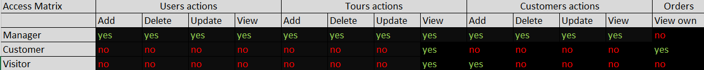

# Project description
Current system is meant to provide to users an opportunity for ordering vacation tours.
Visitors can register, list and buy tours. System has a Manager role for handling systems entities. 

# Project layers
+ Domain Model (domain entities)
+ Data Access Layer (data access objects)
+ Service Layer (services)
+ UI Layer (controllers, views)

# Acting roles
+ Tour Manager (admin)
+ Customer
+ Visitor

# Entity
+ Users
+ Tours
+ Orders

# Technological Stack
+ Language - Java 8
+ DB - PostgreSQL
+ Test framework - JUnit 5
+ Build tool - Maven
+ Code coverage tool - Jacoco
+ Annotation processor & code generatation - Lombok
+ CI tool - Jenkins
+ Deployment - Docker
+ Version comtrol - Git/Gitlab

# DB Schema

# Use Case diagram

# Access Matrix

# Local Deployment Instruction
1. Install Intellij Idea Ultimate
2. Install Tomcat 9.0.X
3. Checkout project into Idea from https://Roman_Samotoshenkov@git.epam.com/Mikhail_Sosnin/180813-studentproject.git
4. Set configuration for Tomcat with Edit Configurations in Idea (choose port and Tomcat folder)
5. Add Deployment Artifacts on the next tab of configurator
6. Run configuration