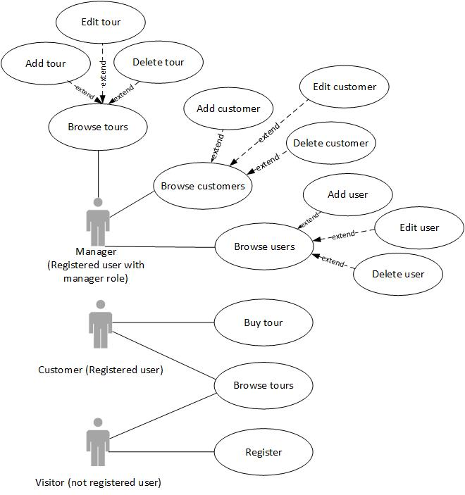

# Project description
Current system is meant to provide to users an opportunity for ordering vacation tours.
Visitors can register, list and buy tours. System has a Manager role for handling systems entities. 

# Project layers
+ Domain Model (domain entities)
+ Data Access Layer (data access objects)
+ Service Layer (services)
+ UI Layer (controllers, views)

# Acting roles
+ Tour Manager (admin)
+ Customer
+ Visitor

# Entity
+ Users
+ Tours
+ Orders

# Technical stack
+ Language - Java 8
+ DB - PostgreSQL
+ Test framework - JUnit 5
+ Build tool - Maven
+ Code coverage tool - Jacoco
+ Logging tool - Log4j2
+ Annotation processor - Lombok

# DB Schema

# Use Case diagram

# Access Matrix
